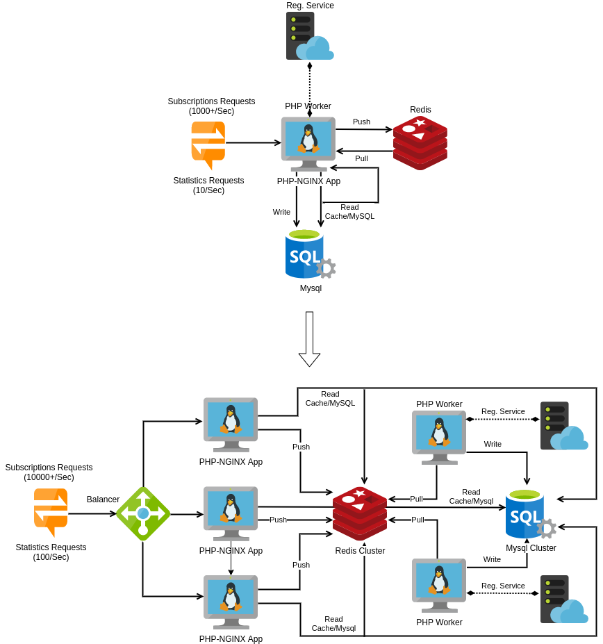

#  MOBILE SUBSCRIPTIONS PROJECT  

## INTRO & BACKGROUND INFO

This is a mobile subscription application. Clients can subscribe to our services via SMS's messages.
For example, the Client sends an SMS with subscription request 'ON LEARNING' to shortcode 742788 to subscribe to our mobile learning services.

You will notice that there's a bottleneck(on purpose). The registration service: `registermo`(It's a *placeholder* for external process and API calls we have no control over) is inherently slow, and you could
assume there is nothing you can do to improve the command(`bin/registermo`).

In spite of such delay(bootleneck):
- We can still handle several THOUSANDS of requests per second(Async)
- We can get latest live-statistics, using indexes and cache(5 secs)
- We can execute commands.

Sometimes the registration process could fail(rare times during hours), so is convenient the application could handle such a scenario and
record failed cases for next tries or deletions.  

### Why this approach ??? 

To be able to reach such performance and prepare the application for scaling:
- I had to use symfony LTS because symfony provides isolated components and follows good design pattern in favor of reactive systems, injections. 
- I had to use the minimal components(ORM MAPPER, CACHE, MIGRATIONS, SERIALIZATIONS, QUEUE) to reach thousands of subscriptions and at the same time show LIVE stats.
- I had to provide DB abstraction, so the test suite could be performed quickly(sqlite) without DB server dependency  
- I had to transform PHP, "interpreted language" to "compiled language" allocating repeated file access in shared memory(opcache.preload), and reuse compilation results without recompile(opcache.validate, etc).
- I had to use Queue Memory System to speed up write operations. 
- I had to use nginx instead of apache to gain more performance. 

The main job is made by a process worker(bin/backgroundProcess)

Recently the application has increasing its demands so had to evolved from Monolithic to Microservices, keeping the same application code(just change config files) and gaining: 
- High Availability(No Single point of failure.)
- High Performance incremented, as more PHP-Nodes can be added.

 
## SETUP

* Install git && install docker engine && docker-compose
* `git clone <this repository url>`

You could run the application in 2 modes:

### MONOLITHIC OPTION
* `docker-compose -f docker/mono/docker-compose.yml up`

### MICROSERVICES OPTION
* `docker-compose -f docker/micros/docker-compose.yml --compatibility up`

* Install(outside containers) apache-benchmark(`ab`) to check the performance or use any other similar tool(`wrk`)

## RUN
### Checking performance:
`ab -p post-request.txt -T application/json -n 1000 -c 100 http://127.0.0.1/subscribe`   

You can find `post-request.txt` file inside the root directory.

### Show LIVE stats:
`curl -H "Content-Type: application/json" http://localhost/stats`

### Execute Test:
`bin/console --env test doctrine:migrations:migrate -vv --no-interaction && bin/phpunit`

### Available Commands:
Additionally, inside any PHP container you could execute any of the following commands(go to /var/www/html):  

`bin/console`                                => Show all available options.   
`bin/console app:populate-database`          => Populate the DB.  
`bin/console app:truncate-database`          => Truncate the DB.  
`bin/console app:total-unprocessed-reqs`     => Check unprocessed requests.  
`bin/console app:del-unprocessed-reqs`       => Delete unprocessed requests.

## INTENTION
I try to show a minimal part of what I've learned/applied during my career, so you can get a idea of what you can expect from me: 
- Clean code:
    - Organization of classes and components
    - Use SOLID principles. Through all the code.
    - Independent services. Ex: you can easily change the cache driver(from apcu to redis), without touching the code
- Hardening Servers, System Design, move smoothly from Monolithic to Microservices
- High performance/availability (benchmarks for checking the performance & Docker to scale out the application)
- Testing, I did functional & unit tests. No code without test :) 
- ...

### FINAL THOUGHTS
Of course this could be better!. WIPs & CI/CD pipelines are missing, I'll try to make them depending on my spare time.   
I hope my code speak for itself, any doubt please make me know it.

## LICENSE

MIT License
